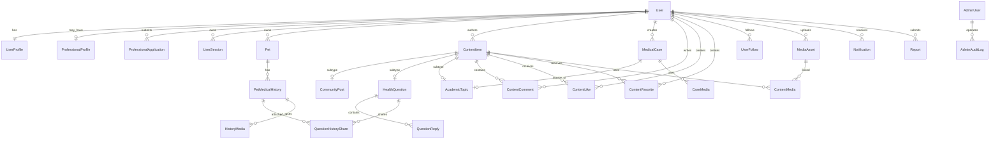

# Pawtrace 第一版数据库设计

> 文档状态：已确认  
> 版本：v0.2  
> 更新日期：2026-10-08  
> 数据库：MySQL 8.4  
> ORM：Prisma 6  
> 前置文档：[MVP-PRD-v1.md](./MVP-PRD-v1.md)、[UX-FLOW-v1.md](./UX-FLOW-v1.md)

## 1. 设计目标

- 所有前台用户默认拥有宠物主人能力，不在用户表中维护可互斥的“主人角色”。
- 宠物医生或医生助理通过专业认证档案获得附加权限。
- 宠物病史与专业病例严格分开。
- 公开问答和指定医生私密提问使用同一问题模型，通过可见性区分。
- 社区帖子、健康问题和学术讨论共享点赞、收藏、评论及媒体基础能力。
- 私密病例、专业认证材料、手机号和私密问题不能被公开查询路径访问。
- 第一版使用逻辑删除和审计字段，避免误删医疗相关记录。

## 2. 数据约定

### 2.1 命名

- Prisma 模型使用单数 PascalCase，例如 `ProfessionalProfile`。
- 数据库表使用复数 snake_case，例如 `professional_profiles`。
- 字段使用 camelCase，映射到数据库 snake_case。
- 主键统一为自增 `Int`；外部接口不得依赖 ID 连续性。
- 时间统一保存为 UTC `DateTime(3)`，客户端按用户时区展示。

### 2.2 通用字段

业务主表原则上包含：

| 字段 | 类型 | 说明 |
| --- | --- | --- |
| `id` | Int | 自增主键 |
| `createdAt` | DateTime(3) | 创建时间 |
| `updatedAt` | DateTime(3) | 更新时间 |
| `deletedAt` | DateTime(3)? | 逻辑删除时间 |

需要发布管理的内容额外包含：

| 字段 | 类型 | 说明 |
| --- | --- | --- |
| `status` | Enum | 草稿、已发布、已下架、已删除等 |
| `publishedAt` | DateTime(3)? | 首次发布时间 |
| `moderatedAt` | DateTime(3)? | 最近审核处理时间 |

### 2.3 删除策略

- 用户、宠物、宠物病史、病例、问题和帖子使用逻辑删除。
- 点赞、收藏和关注可以物理删除，但需要唯一索引防重复。
- 认证申请、管理员操作日志不能由普通用户删除。
- 删除用户时先禁用登录并隐藏公开内容；永久清理属于后续合规流程，不在 MVP 管理后台提供。

## 3. ER 总览



## 4. 身份与认证

### 4.1 `users`

账户根表。注册即拥有宠物主人能力，不需要 `OWNER` 角色记录。

| 字段 | 类型 | 约束与说明 |
| --- | --- | --- |
| `id` | Int | PK |
| `phoneCountryCode` | VarChar(8) | 默认 `+86` |
| `phoneNumber` | VarChar(32) | 规范化手机号 |
| `phoneVerifiedAt` | DateTime(3)? | 首次验证时间 |
| `status` | UserStatus | `ACTIVE`、`DISABLED`、`CANCELLED` |
| `lastLoginAt` | DateTime(3)? | 最近登录时间 |
| `createdAt` | DateTime(3) |  |
| `updatedAt` | DateTime(3) |  |
| `deletedAt` | DateTime(3)? |  |

索引：

- 唯一索引：`(phoneCountryCode, phoneNumber)`。
- 普通索引：`(status, createdAt)`。

手机号禁止出现在公开 DTO、全文搜索和普通日志中。

### 4.2 `user_profiles`

| 字段 | 类型 | 约束与说明 |
| --- | --- | --- |
| `userId` | Int | PK、FK → users.id |
| `nickname` | VarChar(50) | 必填 |
| `avatarMediaId` | Int? | FK → media_assets.id |
| `bio` | VarChar(500)? | 个人简介 |
| `locationText` | VarChar(100)? | 可选模糊地区，不存详细地址 |
| `profileCompletedAt` | DateTime(3)? | 首次资料完成时间 |
| `createdAt` | DateTime(3) |  |
| `updatedAt` | DateTime(3) |  |

### 4.3 `verification_codes`

| 字段 | 类型 | 约束与说明 |
| --- | --- | --- |
| `id` | Int | PK |
| `phoneCountryCode` | VarChar(8) |  |
| `phoneNumber` | VarChar(32) |  |
| `purpose` | VerificationPurpose | MVP 为 `LOGIN` |
| `codeHash` | VarChar(255) | 只保存验证码哈希，不保存明文 |
| `expiresAt` | DateTime(3) | 5 分钟过期 |
| `consumedAt` | DateTime(3)? | 使用时间 |
| `attemptCount` | Int | 默认 0 |
| `requestIp` | VarChar(64)? | 风控用途 |
| `createdAt` | DateTime(3) |  |

索引：`(phoneCountryCode, phoneNumber, purpose, createdAt)`。

演示环境返回的明文模拟验证码只存在于本次接口响应，不写入日志和数据库。

### 4.4 `user_sessions`

| 字段 | 类型 | 约束与说明 |
| --- | --- | --- |
| `id` | Int | PK |
| `userId` | Int | FK → users.id |
| `sessionTokenHash` | VarChar(255) | 不透明 Session Token 哈希，不保存 Cookie 原文 |
| `csrfTokenHash` | VarChar(255) | 写操作 CSRF Token 哈希 |
| `userAgent` | VarChar(500)? | 设备信息 |
| `ipAddress` | VarChar(64)? | 最近 IP |
| `expiresAt` | DateTime(3) | 过期时间 |
| `revokedAt` | DateTime(3)? | 主动退出或封禁 |
| `createdAt` | DateTime(3) |  |
| `updatedAt` | DateTime(3) |  |

索引：`(userId, revokedAt, expiresAt)`。

前台浏览器只保存设置了 `HttpOnly`、`Secure`、`SameSite=Lax` 的 Session Cookie。服务端按 Cookie 中的随机令牌哈希查询会话；前端 JavaScript 不接触登录凭证。

### 4.5 `professional_profiles`

每个用户最多一条当前专业档案。

| 字段 | 类型 | 约束与说明 |
| --- | --- | --- |
| `id` | Int | PK |
| `userId` | Int | FK、唯一 |
| `type` | ProfessionalType | `VETERINARIAN`、`ASSISTANT` |
| `status` | ProfessionalStatus | `PENDING`、`APPROVED`、`REJECTED`、`REVOKED` |
| `realName` | VarChar(80) | 私密，仅本人和管理员 |
| `displayName` | VarChar(80) | 公开展示 |
| `organization` | VarChar(150) | 所属医院或机构 |
| `yearsOfPractice` | UnsignedTinyInt | 0–80 |
| `specialties` | JSON | 第一版存字符串数组，后续可规范化 |
| `introduction` | VarChar(1000)? | 公开简介 |
| `approvedAt` | DateTime(3)? | 通过时间 |
| `revokedAt` | DateTime(3)? | 撤销时间 |
| `createdAt` | DateTime(3) |  |
| `updatedAt` | DateTime(3) |  |

只有 `status = APPROVED` 时才获得专业权限。后端同时校验 `type`：只有 `VETERINARIAN` 可以回答健康问题和接收个人提问。

### 4.6 `professional_applications`

保留每次申请和升级记录，不能只覆盖当前资料。

| 字段 | 类型 | 约束与说明 |
| --- | --- | --- |
| `id` | Int | PK |
| `userId` | Int | FK → users.id |
| `requestedType` | ProfessionalType | 申请身份 |
| `realName` | VarChar(80) | 申请快照 |
| `displayName` | VarChar(80) | 申请快照 |
| `organization` | VarChar(150) | 申请快照 |
| `yearsOfPractice` | UnsignedTinyInt | 申请快照 |
| `specialties` | JSON | 申请快照 |
| `introduction` | VarChar(1000)? | 申请快照 |
| `credentialMediaId` | Int | FK → media_assets.id，私密 |
| `status` | ApplicationStatus | `PENDING`、`APPROVED`、`REJECTED`、`CANCELLED` |
| `reviewedByAdminId` | Int? | FK → admin_users.id |
| `reviewNote` | VarChar(500)? | 审核备注或驳回原因 |
| `submittedAt` | DateTime(3) |  |
| `reviewedAt` | DateTime(3)? |  |
| `createdAt` | DateTime(3) |  |
| `updatedAt` | DateTime(3) |  |

应用层限制同一用户最多有一条 `PENDING` 申请。

## 5. 宠物与宠物病史

### 5.1 `pets`

| 字段 | 类型 | 约束与说明 |
| --- | --- | --- |
| `id` | Int | PK |
| `ownerId` | Int | FK → users.id |
| `name` | VarChar(50) | 必填 |
| `species` | PetSpecies | `CAT`、`DOG`、`OTHER` |
| `customSpecies` | VarChar(50)? | species 为 OTHER 时填写 |
| `breed` | VarChar(80)? | 品种 |
| `gender` | PetGender | `MALE`、`FEMALE`、`UNKNOWN` |
| `birthDate` | Date? | 优先保存日期 |
| `ageText` | VarChar(30)? | 日期未知时使用 |
| `weightKg` | Decimal(6,2)? | 当前体重 |
| `neutered` | Boolean? | 是否绝育 |
| `allergies` | Text? | 过敏史 |
| `pastDiseases` | Text? | 既往疾病摘要 |
| `vaccinationInfo` | Text? | 疫苗信息 |
| `dewormingInfo` | Text? | 驱虫信息 |
| `note` | VarChar(1000)? | 备注 |
| `avatarMediaId` | Int? | FK → media_assets.id |
| `status` | PetStatus | `ACTIVE`、`INACTIVE`、`DECEASED` |
| 通用字段 |  | 含 deletedAt |

索引：`(ownerId, status, createdAt)`。

### 5.2 `pet_medical_histories`

主人自行维护的私密健康记录。

| 字段 | 类型 | 约束与说明 |
| --- | --- | --- |
| `id` | Int | PK |
| `petId` | Int | FK → pets.id |
| `recordedByUserId` | Int | FK → users.id，必须是宠物主人 |
| `recordDate` | Date | 记录日期 |
| `title` | VarChar(150) | 疾病或症状名称 |
| `description` | Text | 情况描述 |
| `hospitalName` | VarChar(150)? | 就诊医院 |
| `doctorName` | VarChar(80)? | 接诊医生文本记录 |
| `examinationResult` | Text? | 检查结果 |
| `treatment` | Text? | 用药或治疗 |
| `note` | Text? | 备注 |
| 通用字段 |  | 含 deletedAt |

索引：`(petId, recordDate)`、`(recordedByUserId, createdAt)`。

## 6. 内容基础模型

### 6.1 `content_items`

社区帖子、健康问题和学术讨论的统一内容入口。

| 字段 | 类型 | 约束与说明 |
| --- | --- | --- |
| `id` | Int | PK |
| `authorId` | Int | FK → users.id |
| `type` | ContentType | `COMMUNITY_POST`、`HEALTH_QUESTION`、`ACADEMIC_TOPIC` |
| `visibility` | ContentVisibility | `PUBLIC`、`DIRECT`、`PROFESSIONAL_ONLY` |
| `status` | ContentStatus | `DRAFT`、`PUBLISHED`、`HIDDEN`、`DELETED` |
| `title` | VarChar(200)? | 日常帖子可为空，其余必填 |
| `body` | Text | 正文 |
| `viewCount` | UnsignedInt | 默认 0，仅作展示缓存 |
| `commentCount` | UnsignedInt | 默认 0 |
| `likeCount` | UnsignedInt | 默认 0 |
| `favoriteCount` | UnsignedInt | 默认 0 |
| `publishedAt` | DateTime(3)? |  |
| `moderatedAt` | DateTime(3)? |  |
| `moderationReason` | VarChar(500)? | 下架原因 |
| 通用字段 |  | 含 deletedAt |

校验规则：

- 社区帖子必须为 `PUBLIC`。
- 公开问题为 `PUBLIC`，个人提问为 `DIRECT`。
- 学术讨论必须为 `PROFESSIONAL_ONLY`。
- `type` 与对应子表必须一一匹配。

索引：

- `(type, visibility, status, publishedAt)`：各信息流。
- `(authorId, type, status, createdAt)`：个人主页和我的发布。
- `(status, moderatedAt)`：后台管理。

### 6.2 `community_posts`

| 字段 | 类型 | 约束与说明 |
| --- | --- | --- |
| `contentId` | Int | PK、FK → content_items.id |
| `postType` | CommunityPostType | `PET_DAILY`、`PET_KNOWLEDGE` |
| `petId` | Int? | FK → pets.id，只能关联自己的宠物 |

### 6.3 分类与标签

`categories`：平台维护的分类树。

| 字段 | 类型 | 说明 |
| --- | --- | --- |
| `id` | Int | PK |
| `scope` | CategoryScope | `QUESTION`、`ACADEMIC`、`COMMUNITY` |
| `name` | VarChar(50) | 分类名 |
| `slug` | VarChar(80) | 同 scope 唯一 |
| `parentId` | Int? | 自关联 |
| `sortOrder` | Int | 排序 |
| `enabled` | Boolean | 是否启用 |

`tags`：内容标签，包含 `id`、`scope`、`name`、`slug`、`enabled`。

`content_tags`：`contentId + tagId` 联合主键。

健康问题使用单个 `categoryId`；社区和学术讨论可以关联最多 5 个标签。

## 7. 健康问答

### 7.1 `health_questions`

| 字段 | 类型 | 约束与说明 |
| --- | --- | --- |
| `contentId` | Int | PK、FK → content_items.id |
| `petId` | Int | FK → pets.id，必须属于提问者 |
| `categoryId` | Int | FK → categories.id |
| `mode` | QuestionMode | `PUBLIC_FORUM`、`DIRECT_DOCTOR` |
| `assignedDoctorUserId` | Int? | 个人提问时必填，必须是认证宠物医生 |
| `status` | QuestionStatus | `WAITING`、`ANSWERED`、`RESOLVED`、`CLOSED` |
| `symptomDuration` | VarChar(100) | 必填 |
| `mentalState` | VarChar(500)? | 精神状态 |
| `dietAndWater` | VarChar(500)? | 饮食饮水 |
| `excretion` | VarChar(500)? | 排泄情况 |
| `measuresTaken` | VarChar(1000)? | 已采取措施 |
| `helpfulReplyId` | Int? | 标记有帮助的医生回答 |
| `closedByUserId` | Int? | 关闭操作者 |
| `closedReason` | VarChar(300)? | 关闭原因 |
| `resolvedAt` | DateTime(3)? | 解决时间 |
| `closedAt` | DateTime(3)? | 关闭时间 |

索引：

- `(mode, status, createdAt)`。
- `(assignedDoctorUserId, status, createdAt)`：医生个人提问待办。
- `(petId, createdAt)`：宠物相关问题。

### 7.2 `question_replies`

问答采用有序会话模型，不与普通内容评论混用。

| 字段 | 类型 | 约束与说明 |
| --- | --- | --- |
| `id` | Int | PK |
| `questionContentId` | Int | FK → health_questions.contentId |
| `authorId` | Int | FK → users.id |
| `parentReplyId` | Int? | 自关联，最多一层追问 |
| `role` | QuestionReplyRole | `DOCTOR_ANSWER`、`OWNER_FOLLOW_UP`、`DOCTOR_FOLLOW_UP` |
| `body` | Text | 回复正文 |
| `status` | ReplyStatus | `PUBLISHED`、`HIDDEN`、`DELETED` |
| `createdAt` | DateTime(3) |  |
| `updatedAt` | DateTime(3) |  |
| `deletedAt` | DateTime(3)? |  |

权限校验：

- `DOCTOR_ANSWER` 和 `DOCTOR_FOLLOW_UP` 仅认证宠物医生。
- `OWNER_FOLLOW_UP` 仅问题作者。
- 个人提问只能由被指定医生回答。

### 7.3 `question_history_shares`

| 字段 | 类型 | 约束与说明 |
| --- | --- | --- |
| `questionContentId` | Int | FK → health_questions.contentId |
| `historyId` | Int | FK → pet_medical_histories.id |
| `sharedByUserId` | Int | FK → users.id |
| `createdAt` | DateTime(3) |  |

联合主键：`(questionContentId, historyId)`。

可见规则：

- 公开问题：问题作者、认证宠物医生和认证医生助理可读，普通浏览者不可读。
- 个人提问：仅问题作者和指定医生可读。
- 删除共享关系不会删除原宠物病史。

## 8. 专业病例与学术论坛

### 8.1 `medical_cases`

| 字段 | 类型 | 约束与说明 |
| --- | --- | --- |
| `id` | Int | PK |
| `createdByUserId` | Int | FK → users.id，必须有已通过专业身份 |
| `title` | VarChar(200) | 必填 |
| `animalSpecies` | VarChar(50) | 动物类型 |
| `breed` | VarChar(80)? | 品种 |
| `gender` | PetGender | 性别 |
| `ageText` | VarChar(30) | 年龄描述 |
| `chiefComplaint` | Text | 主诉 |
| `history` | Text? | 病史 |
| `physicalExamination` | Text? | 体格检查 |
| `auxiliaryExamination` | Text? | 辅助检查 |
| `assessment` | Text? | 初步判断 |
| `treatmentPlan` | Text? | 诊疗方案 |
| `followUpResult` | Text? | 随访与结果 |
| `status` | MedicalCaseStatus | `DRAFT`、`IN_TREATMENT`、`CLOSED` |
| 通用字段 |  | 含 deletedAt |

索引：`(createdByUserId, status, updatedAt)`。

病例仅创建者可读写。第一版不支持团队共享或管理员直接浏览病例正文。

### 8.2 `academic_topics`

| 字段 | 类型 | 约束与说明 |
| --- | --- | --- |
| `contentId` | Int | PK、FK → content_items.id |
| `topicType` | AcademicTopicType | `CASE_DISCUSSION`、`CLINICAL_EXPERIENCE`、`ACADEMIC_QUESTION` |
| `sourceCaseId` | Int? | FK → medical_cases.id，仅记录来源 |

从病例发布讨论时创建独立 `ContentItem + AcademicTopic`，复制经过匿名化确认的公开正文和媒体。以后修改或删除私密病例，不自动修改已发布讨论。

## 9. 评论、互动与关注

### 9.1 `content_comments`

用于社区帖子和学术讨论，不用于健康问答。

| 字段 | 类型 | 约束与说明 |
| --- | --- | --- |
| `id` | Int | PK |
| `contentId` | Int | FK → content_items.id |
| `authorId` | Int | FK → users.id |
| `parentCommentId` | Int? | 自关联，第一版最多两层 |
| `replyToUserId` | Int? | 被回复用户 |
| `body` | VarChar(2000) | 评论内容 |
| `status` | CommentStatus | `PUBLISHED`、`HIDDEN`、`DELETED` |
| 通用字段 |  | 含 deletedAt |

学术讨论评论时需要再次校验用户是已认证专业人员。

### 9.2 `content_likes`

字段：`contentId`、`userId`、`createdAt`；联合主键 `(contentId, userId)`。

### 9.3 `content_favorites`

字段：`contentId`、`userId`、`createdAt`；联合主键 `(contentId, userId)`。

### 9.4 `user_follows`

| 字段 | 类型 | 约束与说明 |
| --- | --- | --- |
| `followerId` | Int | FK → users.id |
| `followingId` | Int | FK → users.id |
| `createdAt` | DateTime(3) |  |

联合主键：`(followerId, followingId)`；应用层禁止自己关注自己。

索引：

- `(followingId, createdAt)`：粉丝列表。
- `(followerId, createdAt)`：关注列表和关注信息流。

第一版关注数和粉丝数实时聚合或轻量缓存，不在用户表中维护强一致计数。

## 10. 媒体模型

### 10.1 `media_assets`

| 字段 | 类型 | 约束与说明 |
| --- | --- | --- |
| `id` | Int | PK |
| `uploaderId` | Int | FK → users.id |
| `kind` | MediaKind | `IMAGE`、`VIDEO`、`DOCUMENT` |
| `visibility` | MediaVisibility | `PUBLIC`、`PRIVATE` |
| `storageKey` | VarChar(500) | 存储层路径，不直接作为公开 URL |
| `originalName` | VarChar(255) | 原文件名，展示前转义 |
| `mimeType` | VarChar(100) | 服务端检测 |
| `sizeBytes` | BigInt | 文件大小 |
| `width` | Int? | 图片/视频宽度 |
| `height` | Int? | 图片/视频高度 |
| `durationSeconds` | Int? | 视频时长 |
| `thumbnailStorageKey` | VarChar(500)? | 缩略图或视频封面 |
| `status` | MediaStatus | `UPLOADING`、`READY`、`FAILED`、`DELETED` |
| `createdAt` | DateTime(3) |  |
| `deletedAt` | DateTime(3)? |  |

### 10.2 媒体关联表

- `content_media(contentId, mediaId, section, sortOrder)`。
- `history_media(historyId, mediaId, section, sortOrder)`。
- `case_media(caseId, mediaId, section, sortOrder)`。
- `reply_media(replyId, mediaId, sortOrder)`，如第一版允许回答附图时启用。

`section` 区分 `IMAGE`、`VIDEO`、`DOCUMENT` 展示分区。同一内容的应用层限制：最多 9 张图片和 1 个视频。认证材料直接由申请表引用，并始终是私密媒体。

## 11. 通知与治理

### 11.1 `notifications`

| 字段 | 类型 | 约束与说明 |
| --- | --- | --- |
| `id` | Int | PK |
| `recipientId` | Int | FK → users.id |
| `actorId` | Int? | 触发用户，系统通知为空 |
| `type` | NotificationType | 回答、追问、评论、认证结果等 |
| `title` | VarChar(150) | 通知标题快照 |
| `body` | VarChar(500)? | 简短内容快照 |
| `targetType` | VarChar(40)? | 跳转对象类型 |
| `targetId` | Int? | 跳转对象 ID |
| `data` | JSON? | 少量附加信息，不存敏感正文 |
| `readAt` | DateTime(3)? | 已读时间 |
| `createdAt` | DateTime(3) |  |

索引：`(recipientId, readAt, createdAt)`。

### 11.2 `reports`

| 字段 | 类型 | 约束与说明 |
| --- | --- | --- |
| `id` | Int | PK |
| `reporterId` | Int | FK → users.id |
| `targetType` | ReportTargetType | 内容、评论、回答、用户 |
| `targetId` | Int | 对象 ID |
| `reason` | ReportReason | 举报分类 |
| `description` | VarChar(1000)? | 补充说明 |
| `status` | ReportStatus | `PENDING`、`PROCESSING`、`RESOLVED`、`REJECTED` |
| `handledByAdminId` | Int? | FK → admin_users.id |
| `resolution` | VarChar(1000)? | 处理结果 |
| `handledAt` | DateTime(3)? |  |
| `createdAt` | DateTime(3) |  |
| `updatedAt` | DateTime(3) |  |

索引：`(status, createdAt)`、`(targetType, targetId)`。

### 11.3 `admin_users`

| 字段 | 类型 | 说明 |
| --- | --- | --- |
| `id` | Int | PK |
| `username` | VarChar(100) | 唯一 |
| `passwordHash` | VarChar(255) | 密码哈希 |
| `displayName` | VarChar(80) | 展示名 |
| `status` | AdminStatus | `ACTIVE`、`DISABLED` |
| `lastLoginAt` | DateTime(3)? |  |
| `createdAt` | DateTime(3) |  |
| `updatedAt` | DateTime(3) |  |

后台账号与前台手机号账户分离。

管理员登录会话单独保存在 `admin_sessions`，字段包括：`id`、`adminUserId`、`sessionTokenHash`、`csrfTokenHash`、`expiresAt`、`revokedAt`、`ipAddress`、`userAgent`、`createdAt`、`updatedAt`。管理员 Cookie 名称、路径和服务端校验均与前台 Session 分离。

### 11.4 `admin_audit_logs`

字段：`id`、`adminUserId`、`action`、`targetType`、`targetId`、`reason`、`metadata JSON?`、`createdAt`。

管理员认证审核、身份撤销、内容上下架、举报处理和用户禁用必须写审计日志。

## 12. 枚举汇总

```text
UserStatus: ACTIVE | DISABLED | CANCELLED
ProfessionalType: VETERINARIAN | ASSISTANT
ProfessionalStatus: PENDING | APPROVED | REJECTED | REVOKED
ApplicationStatus: PENDING | APPROVED | REJECTED | CANCELLED
PetSpecies: CAT | DOG | OTHER
PetGender: MALE | FEMALE | UNKNOWN
PetStatus: ACTIVE | INACTIVE | DECEASED
ContentType: COMMUNITY_POST | HEALTH_QUESTION | ACADEMIC_TOPIC
ContentVisibility: PUBLIC | DIRECT | PROFESSIONAL_ONLY
ContentStatus: DRAFT | PUBLISHED | HIDDEN | DELETED
CommunityPostType: PET_DAILY | PET_KNOWLEDGE
QuestionMode: PUBLIC_FORUM | DIRECT_DOCTOR
QuestionStatus: WAITING | ANSWERED | RESOLVED | CLOSED
QuestionReplyRole: DOCTOR_ANSWER | OWNER_FOLLOW_UP | DOCTOR_FOLLOW_UP
MedicalCaseStatus: DRAFT | IN_TREATMENT | CLOSED
AcademicTopicType: CASE_DISCUSSION | CLINICAL_EXPERIENCE | ACADEMIC_QUESTION
MediaKind: IMAGE | VIDEO | DOCUMENT
MediaVisibility: PUBLIC | PRIVATE
MediaStatus: UPLOADING | READY | FAILED | DELETED
```

其余审核、举报和评论状态枚举在 Prisma 落地时按本文字段补齐。

## 13. 权限查询边界

以下规则必须写在服务层查询条件中，不能只在返回后过滤：

- 宠物及病史：`ownerId = currentUser.id`。
- 私密病例：`createdByUserId = currentUser.id`。
- 个人提问：作者或 `assignedDoctorUserId = currentUser.id`。
- 公开问题附带病史：作者、已认证宠物医生或已认证医生助理。
- 学术内容：当前用户专业状态为 `APPROVED`，类型为医生或医生助理。
- 认证材料：申请人本人或管理员。
- 私密媒体：先校验其关联业务对象权限，再签发短期访问地址。

管理员不能通过普通公开 API 绕过业务权限。管理端如需查看敏感材料，使用独立后台接口并写审计记录。

## 14. 一致性与事务

以下操作使用数据库事务：

- 新用户登录：创建用户、用户资料和会话。
- 发布内容：创建 `content_items`、子类型表、标签及媒体关联。
- 医生回答首条问题：创建回答并将问题从 `WAITING` 更新为 `ANSWERED`。
- 标记有帮助/已解决：校验回答归属并更新问题状态。
- 专业认证通过：更新申请、创建或更新专业档案、写管理员审计日志、创建通知。
- 发布病例讨论：创建学术内容、复制匿名化内容和媒体关联。
- 内容下架：更新内容状态、写审计日志并通知作者。

互动计数字段允许最终一致：先保证点赞、收藏或评论明细正确，再更新缓存计数。

## 15. 搜索设计

MVP 不引入 Elasticsearch：

- 社区、问答和学术内容按 `title`、`body` 使用 MySQL 查询。
- 列表先按权限、类型和状态过滤，再进行关键词匹配。
- 私密病例、宠物病史、个人提问、手机号和认证材料不进入公共搜索。
- 数据量增长后再评估 MySQL FULLTEXT 或独立搜索服务。

## 16. 当前演示数据迁移说明

现有 Prisma Schema 中：

- `User` 使用邮箱，与手机号登录需求不匹配。
- `Pet` 没有 `ownerId`，且年龄、体重等字段全部必填。
- 当前宠物 API 没有登录和资源归属校验，并执行物理删除。

正式实现时建议创建一条新的基线迁移，开发环境演示数据可以重新生成，不直接把当前两表视为生产兼容结构。执行任何清库或重建操作前需要单独确认。

## 17. 建议实现顺序

1. 用户、资料、验证码和会话。
2. 媒体资产基础表。
3. 专业认证、管理员和审计日志。
4. 宠物与宠物病史。
5. 内容主表、社区帖子、标签和互动。
6. 健康问题、回答和病史共享。
7. 专业病例和学术讨论。
8. 通知、举报及后台治理。

## 18. 已确认的数据决策

1. 同一用户第一版最多持有一种当前专业身份；医生助理升级宠物医生后，当前身份切换为宠物医生，但保留历史申请记录。
2. 专业擅长领域第一版存为 JSON 字符串数组，后续有运营配置需求时再拆成字典和关联表。
3. 公开问题附带的宠物病史仅作者、认证宠物医生和认证医生助理可查，普通浏览者不可查。
4. 病例库完全个人私密，管理员默认也不能浏览病例正文。
5. 公开内容采用统一 `content_items` 主表，社区、问答和学术内容分别使用一对一子表。
6. 内容统计数为缓存字段，允许短暂延迟，以点赞、收藏和评论明细表为准。
7. 当前演示数据库不做兼容迁移；数据库设计确认后以新基线迁移和种子数据替换。
